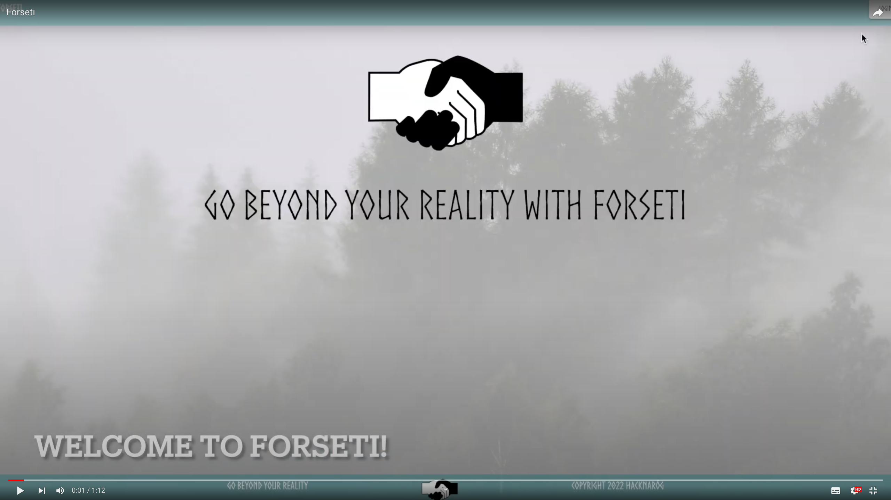

### Tired of your filter bubble? Want to meet someone with different opinion anywhere in the world? Let's create new reality of open-minded people. Select a topic and start a conversation with a stranger.

## Demo: 

[https://youtu.be/EwzhlJrdkys](https://youtu.be/EwzhlJrdkys) 

## IaC: https://github.com/HackNarog2022/forseti_azure_configuration

## Inspiration
We asked ourselves a question - what is the "new reality"? For us the answers were:
- we live in a filter bubble wanting to talk only with people with the same opinions
- pandemic really limited the possibility to exchange ideas
- we started to travel again across the world and want to talk with locals
- diversity became an important topic and new standards are needed 

Forseti (the name of the app) comes from Norse mythology (as well as the font used in the app) and it's the name of the god of justice and peace and reconciliation.

## What it does
As a response to the points from previous section our app lets people to find other ones interested in 
similar topics with different or the same level of domain knowledge and exchange ideas through a meeting. Moreover it suggests questions and readings to make conversation more fluent and natural.  We don't ask about gender, age, religion, nationality and your beliefs, we just want you to reach people from all around the world and exchange ideas.  

Tenets:
- make people more open
- promote diversity
- expand our knowledge 
- broaden your horizons

so in 4 words: Go beyond your reality!

Usage is so simple:
- Create a request about what you want to talk
- Wait for a person matching your request
- Write an email, discuss and meet!

Stay safe! Our app prevents from receiving hostile message with the use of AI (hostile requests are blocked) and users rating system.

## How we built it
Leveraging knowledge from many widely-known, big IT companies, state-of-the-art technologies, endless discussions and what's most important - teamwork and pair programming

## Challenges we ran into
- frontend development when you you didn't touch it for a while
- granular permissions of Azure B2C
- B2C is easy for ASP .NET - we wanted to make it for Spring

## Accomplishments that we're proud of
- we would really see it as real-life solution
- monetization idea (sponsored suggested places to meet, sponsored topics to discuss, premium account - allows for having more than 5 meetings in a month and 5 concurrent requests)
- probably the only app in the hackaton that has fully operating users management system (Azure B2C)
- app is fully deployed (continuous delivery!): https://forsetihacknarog.azurewebsites.net. We are not afraid - feel free to try it out. Create a user and meet!
- it looks well, having in mind that was designed by 4 typical programmers

## What we learned
In our field of study continuous development is of significant importance, this weekend the points are: 
- Azure B2C is pretty powerful, has really granular permissions and it's painful to forget about even one
- rediscovered how to center a button in html (sentiment analysis was easier)
- despite each of us works in a different technology daily we realized that Java is the one that everyone knows quite well
- wide range of ML services provided by the clouds
- 4 typical backend programmers (in flannel shirts) can create not so bad UI  

## What's next for Forseti
- wide database of materials, reading, experts, questions, topics
- tests if you are really a domain expert
- security and verification of users

## Tech Stack
Because of awesomeness of cloud computing we decided to heavily leverage Azure cloud services: business-2-customers (B2C), sentiment analysis, database, deployment. Because of the limited time we used widely known Spring backend and Angular frontend, with which everyone was a bit familiar. But despite a short time we didn't abandoned software engineering basics like CI/CD. Architecture is pretty easy - a single frontend and a scalable backend.
